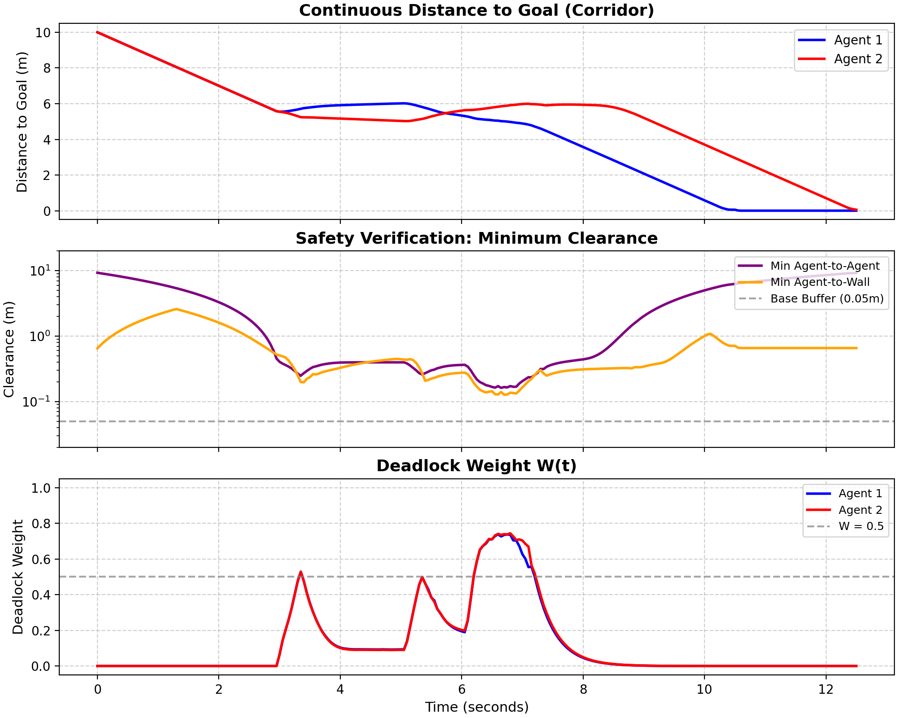
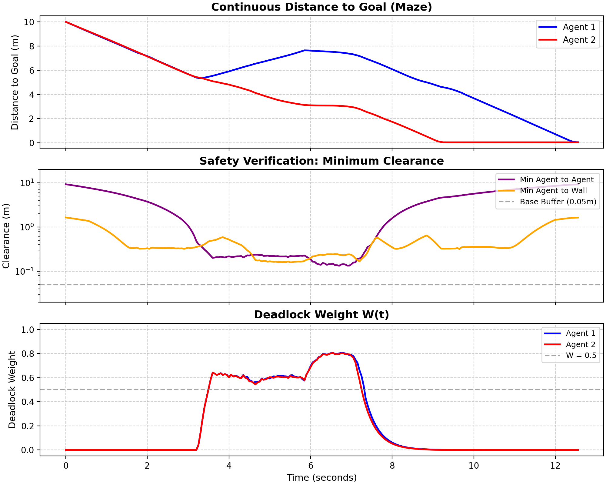
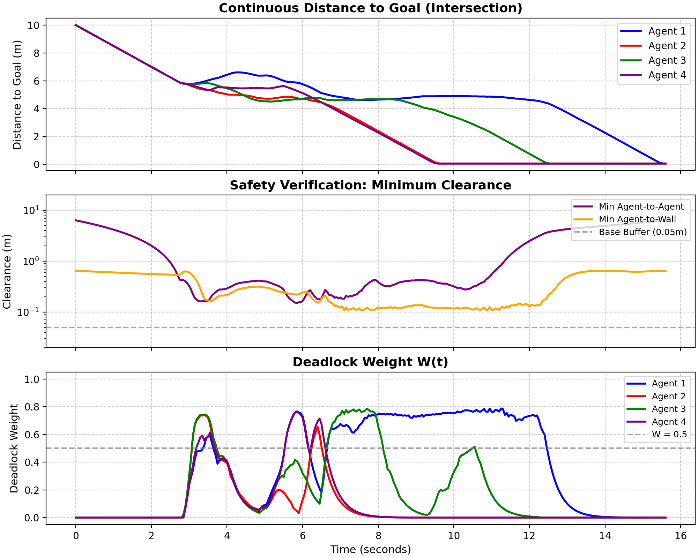

# Decentralized Deadlock-Free Multi-Agent Path Planning via Continuous-Time ODEs

Decentralized multi-agent navigation in continuous time. Agents get through narrow corridors and
intersections with no communication, no IDs, and no priority rules.

## How it works

Each agent has state `[x, y, W]`, where `W` is a deadlock weight. All agents are integrated together
as one ODE with `scipy.integrate.solve_ivp`.

* **Global path.** RRT* with bridge sampling, which samples pairs of points inside obstacles and
keeps the midpoint if it is free to find narrow gaps that uniform sampling misses.

* **Local tracking.** Artificial potential field (APF). Each agent's safety bubble depends only on its own
speed, from 5 cm when stopped to 50 cm at full speed.

* **Deadlock.** `W` rises when forward progress along the path stalls and decays when it resumes.
While `W` is high, a random perturbation is added to the spline tangent, held for a trial period, and 
resampled if the agent is still stuck. The agent's safety bubble contracts in proportion to `W`. The 
perturbation is scaled by `W` and vanishes once the agent is moving again. Symmetric deadlock breaks 
through the randomized actions rather than through a rule.

Because every agent draws its own parameters, two agents can't mirror each other forever, and a
stuck agent **resolves the deadlock with one probability**.

## Demo

Corridor and maze gaps are set by `get_scenario(name, gap=1.6)`. At 1.6 m two robots can't pass
at full speed, so every run below needs the deadlock mechanism.

### Corridor

<table>
<tr>
<th width="48%">Animation</th>
<th width="52%">Distance to goal, clearance, W(t)</th>
</tr>
<tr>
<td valign="middle" align="center">
<video src="REPLACE_WITH_CORRIDOR_VIDEO_URL" controls="controls" width="100%"></video>
</td>
<td valign="middle" align="center">

</td>
</tr>
</table>

### Maze

<table>
<tr>
<th width="48%">Animation</th>
<th width="52%">Distance to goal, clearance, W(t)</th>
</tr>
<tr>
<td valign="middle" align="center">
<video src="REPLACE_WITH_MAZE_VIDEO_URL" controls="controls" width="100%"></video>
</td>
<td valign="middle" align="center">

</td>
</tr>
</table>

### Intersection

<table>
<tr>
<th width="48%">Animation</th>
<th width="52%">Distance to goal, clearance, W(t)</th>
</tr>
<tr>
<td valign="middle" align="center">
<video src="REPLACE_WITH_INTERSECTION_VIDEO_URL" controls="controls" width="100%"></video>
</td>
<td valign="middle" align="center">

</td>
</tr>
</table>

## Run

```bash
python main.py --map corridor
python main.py --map maze
python main.py --map intersection
```

Needs `numpy`, `scipy`, `matplotlib`.