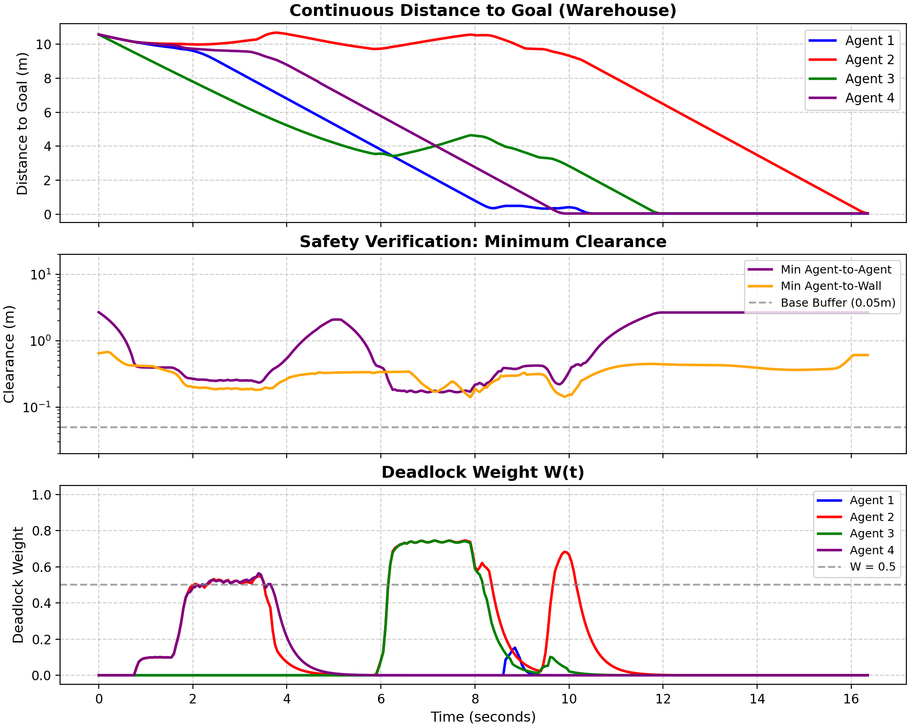

# Decentralized Deadlock-Free Multi-Agent Path Planning via Continuous-Time ODEs

Decentralized multi-agent navigation in continuous time. Agents get through corridors,
intersections, and warehouse aisles with no communication, no IDs, and no priority rules.

## How it works

Each agent has state `[x, y, W]`, where `W` is a deadlock weight. All agents are integrated together
as one ODE with `scipy.integrate.solve_ivp`.

* **Global path:** RRT* with bridge sampling, which samples pairs of points inside obstacles and
keeps the midpoint if it is free to find narrow gaps that uniform sampling misses.

* **Local tracking:** Artificial potential field (APF). Each agent's safety bubble depends only on its own
speed, from 5 cm when stopped to 50 cm at full speed.

* **Deadlock:** `W` rises when forward progress along the path stalls and decays when it resumes.
While `W` is high, a random perturbation is added to the spline tangent, held for a trial period, and 
resampled if the agent is still stuck. The agent's safety bubble contracts in proportion to `W`. The 
perturbation is scaled by `W` and vanishes once the agent is moving again. Symmetric deadlock breaks 
through the randomized actions rather than through a rule.

Because every agent draws its own parameters, two agents can't mirror each other forever, and a
stuck agent escapes with probability one.

## Demo

### Warehouse

Four agents, two aisles joined only at the ends, each agent crossing from one aisle to the other.
Four deadlock events per run, one of them three-way.

<table>
<tr>
<th width="48%">Animation</th>
<th width="52%">Convergence and safety metrics</th>
</tr>
<tr>
<td valign="middle" align="center">
<video src="REPLACE_WITH_WAREHOUSE_VIDEO_URL" controls="controls" width="100%"></video>
</td>
<td valign="middle" align="center">
<a href="output/timeseries_warehouse.png"></a>
</td>
</tr>
</table>

### Corridor

<table>
<tr>
<th width="48%">Animation</th>
<th width="52%">Convergence and safety metrics</th>
</tr>
<tr>
<td valign="middle" align="center">
<video src="https://github.com/user-attachments/assets/e7846f18-aa7c-4039-9e58-97d0449a3ab6" controls="controls" width="100%"></video>
</td>
<td valign="middle" align="center">
<a href="output/timeseries_corridor.png"></a>
</td>
</tr>
</table>

### Maze

<table>
<tr>
<th width="48%">Animation</th>
<th width="52%">Convergence and safety metrics</th>
</tr>
<tr>
<td valign="middle" align="center">
<video src="https://github.com/user-attachments/assets/ce14da33-bf23-4dd5-9821-0c361475da01" controls="controls" width="100%"></video>
</td>
<td valign="middle" align="center">
<a href="output/timeseries_maze.png"></a>
</td>
</tr>
</table>

### Intersection

<table>
<tr>
<th width="48%">Animation</th>
<th width="52%">Convergence and safety metrics</th>
</tr>
<tr>
<td valign="middle" align="center">
<video src="https://github.com/user-attachments/assets/abfd083b-56a3-477e-8b20-68bfdd924950" controls="controls" width="100%"></video>
</td>
<td valign="middle" align="center">
<a href="output/timeseries_intersection.png"></a>
</td>
</tr>
</table>

## Run

```bash
python main.py --map corridor
python main.py --map maze
python main.py --map intersection
python main.py --map warehouse
```

Needs `numpy`, `scipy`, `matplotlib`.